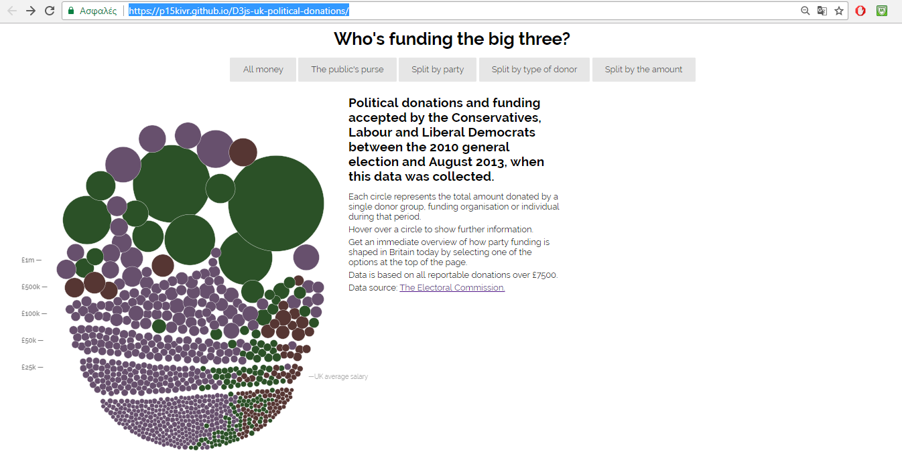
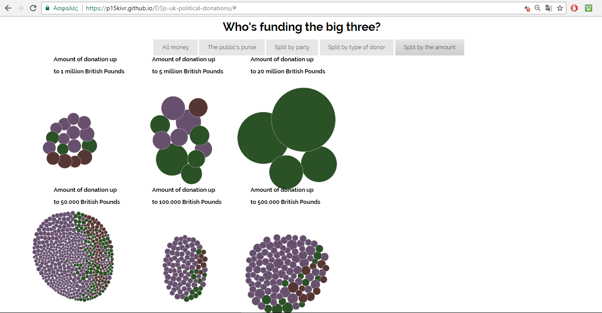
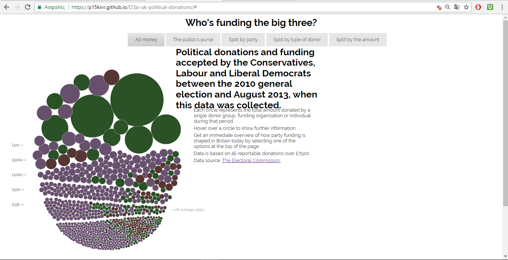
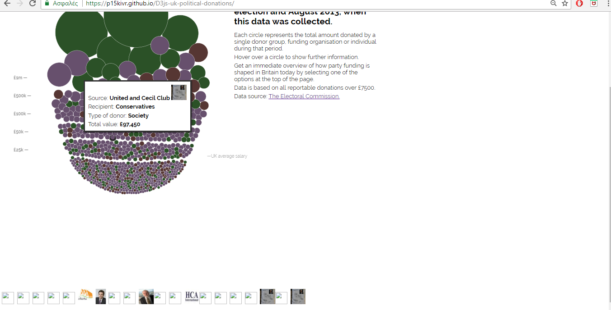

# Οπτικοποίηση δεδομένων με βιβλιοθήκη της D3

# Αρχική αναφορά 1ου παραδοτέου: [Αρχική αναφορά](https://github.com/p15kivr/sw/blob/master/projects/2015087/README.md)

*  Ονοματεπώνυμο: **Ιωάννης Κιβρακίδης**
*  Αριθμός Μητρώου: **Π2015087**
*  Θέμα εργασίας **"Οπτικοποίηση δεδομένων"**
*  Προσωπικό αποθετήριο του κώδικα: [Link Κεντρικού προσωπικού Αποθετηρίου](https://github.com/p15kivr/D3js-uk-political-donations/tree/gh-pages)
*  Link για το εκτελέσιμο: [Link Εκτελέσιμου](https://p15kivr.github.io/D3js-uk-political-donations/)
*  [Link Αποθετηρίου του 1ου παραδοτέου](https://github.com/p15kivr/D3js-uk-political-donations/tree/paradoteo1)
*  [Link Αποθετηρίου του 2ου παραδοτέου](https://github.com/p15kivr/D3js-uk-political-donations/tree/paradoteo2)

## Ο κώδικας τρέχει από το gh-pages branch.

# Σύνοψη

Στα πλαίσια του μαθήματος Τεχνολογία Λογισμικού του διδάσκοντα κ.Χωριανόπουλου, πραγματοποίηθηκε η τροποποίηση ενός κώδικα οπτικοποίησης δεδομένων με χρήση βιβλιοθηκών D3 της javascript. Το τρέχον αρχείο, που αποτελεί τo δεύτερο παραδοτέο της εξαμηνιαίας εργασίας, έχει ως στόχο την εξοικείωση με τη javascript και άλλες γλώσσες προγραμματισμού διαδικτύου (π.χ. css και html) καθώς και με την εισαγωγή στις τεχνολογίες λογισμικού. Σε πρώτο στάδιο έγινε η τροποποίηση του project D3js-uk-political-donations και στη συνέχεια η προσθήκη νέων στοιχείων σε αυτό, όπως νέα αρχεία και κώδικες.

# Διαδικασία ανάπτυξης 1ου παραδοτέου

Αρχικά ξεκίνησα με το να αλλάξω το URL της εργασίας από (https://ioniodi.github.io/D3js-uk-political-donations/full-viz.html) σε
(https://p15kivr.github.io/D3js-uk-political-donations/). Στη συνέχεια έκανα αλλαγή των χρωμάτων στις μπάλες και στα πλαίσια του split by party. Τρίτο βήμα ήταν να προσθέσω ήχο όταν γίνεται κλικ πάνω στα κουμπια που αλλάζει ο διαχωρισμός του σχήματος. Για κάθε μπάλα όπου γίνεται κλικ έκανα μετατροπή ώστε να οδηγεί αυτόν που πατάει πάνω στην αναζήτηση του google για την αντίστοιχη εταιρία ή πρόσωπο και για κάθε μπάλα να εκφωνείται ότι αναγράφεται πάνω της. Επιπλέον πρόσθεσα μια νέα καρτέλα με την ονομασία split by the amount όπου γίνεται ο κατάλληλος διαχωρισμός των χρηματικών ποσών ανά κατηγορία και στο τέλος έκανα τα γράμματα όταν το βελάκι πηγαίνει πάνω σε αυτά να μεγενθύνονται. Υλοποίησα όλες τις απαραίτητες αλλαγές για τα παραπάνω μέσα στα αρχεία με την html, την janascript και την css και τέλος πρόσθεσα 5 εικόνες από εταιρίες τις οποίες μετέτρεψα σε .ico 42x42 px.

# Διαδικασία ανάπτυξης 2ου παραδοτέου

Σε αυτό το παραδοτέο πρόσθεσα ένα στοιχείο element, όπου εμπεριέχει το URL με τις εικόνες των δωρητών, του κοινού αποθετηρίου του κώδικα. Μετά αυτό το στοιχείο δέχεται ύψος και πλάτος και εμφανίζεται στο κάτω μέρος της οθόνης. Ακόμα δημιουργήθηκε ένα νέο πλαίσιο με το όνομα και την εικόνα από το προφίλ μου, με ένα animation διαφορετικό από των υπολοίπων. Αυτό δοκιμάσθηκε στο [προσωπικό ιστότοπο](https://p15kivr.github.io/D3js-uk-political-donations/participants/) και έγινε pull request στο [κοινό αποθετήριο](https://ioniodi.github.io/D3js-uk-political-donations/participants/). Το animation βρέθηκε από αυτόν [τον ιστότοπο](http://tobiasahlin.com/moving-letters/).

# Ενδεικτικές εικόνες

# Συμπεράσματα

Η εργασία αυτή βοηθά το μαθητή να εμπλουτίσει τις γνώσεις του σε θέματα διαδικτυακού προγραμματισμού και προγραμμτισμού τεχνολογίας λογισμικού. Μαθαίνει να τροποποιεί κώδικες και να δημιουργεί νέα αρχεία/κώδικες, που συνισφέρουν σε αυτόν.

# Δικτυογραφία

http://tobiasahlin.com/moving-letters/

https://stackoverflow.com/

https://www.w3schools.com/
